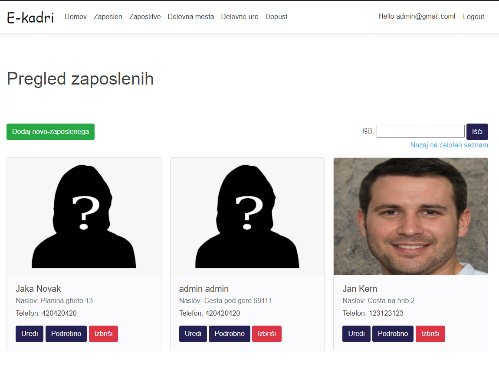
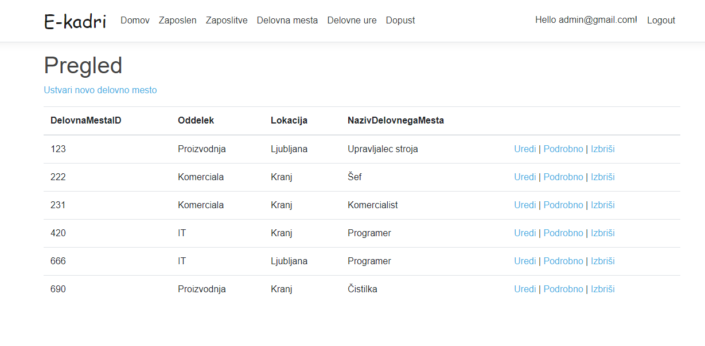

# E-kadri

**Live Demo**: https://e-kadri-dev.azurewebsites.net

Avtorja:
  - Miha Žnidar 63190330
  - Klemen Štefe 63190283

Z informacijskim sistemom E-Kader želimo podpreti informiranje kadrovske službe o trenutjem stanju zaposlenih v celotnem mednarodnem podjetju.
Celotni sistem bo dostopen samo priviligiranim uporabnikom (delavcem v kadrovski službi in ostalim v podjetju).
Omogočal bo dodajanje, odvzemanje novih zaposlenih, pregled informacij o posamezniku, pregled delovnih ur, izbiro dopusta, urnik in še nekaj podrobnosti.
Vsi zaposleni, ter njihovi podatki so zapisani v skupni bazi, ki temelji na Microsoftovi SQL server bazi.

<h4 align="center">Pregled zaposlenih</h4>

<h4 align="center">Delovna mesta</h4>

Funkcionalnosti
---------------

- **Lokalna Avtentikacija** z uporabniškim imenom in geslom
- MVC projektna struktura **(.NET REST)
- Upravljanje z računi
- Swagger API z avtentikacijo
- Podpira CRUD
- Možnost nastavitve odjemalca Android
- Azure ready
- Pregled uporabnikov

Android odjemalec
-----------------

Z informacijskim sistemom lahko poleg spletne različice komunicirate preko **android aplikacije e-kader**. Z njim sta podprta osnovna **GET**
ter **POST** zahtevka preko API vmesnika implementiranega s pomočjo Swaggerja.

**Project:** https://github.com/klemen-1337/e-kader-app

Razporeditev dela
-----------------

Ideja se je porodila, saj je Miha želel izdelati podobno aplikacijo za neko restavracijo. Predstavljena ideja je bila Klemnu všeč, zato sva se lotila z izdelovanjem e-Kadra.
Klemen je vzpostavil github z osnovno aplikacijo, na poratlu Discord sva se zmenila in porazdelila delo, ter probleme, kjer se je zatikalo probavala reševati skupaj.
Najprej, sva skupaj narisala konceptualni model podatkovne baze, Klemen je spisal modele, jih zgeneriral in dodal funkcionalnost dodajanja slik. Miha pa se je lotil izdelovanja logina, registracije, ter avtorizacije. Za izdelavo drugega dela seminarse naloge, je Klemen objavil aplikacijo ter podatkovno bazo v azure. Miha pa je med tem že delal na REST programskem vmesniku in dodal swagger, ki je Klemenu koristil, kot dokumentacija ob izdelavi android aplikacije. Miha je kasneje dodal tudi avtentikacijo na REST vmesnik, za to so bili potrebni manjši popravki pri klicu REST api-jev iz mobilne aplikacije.

