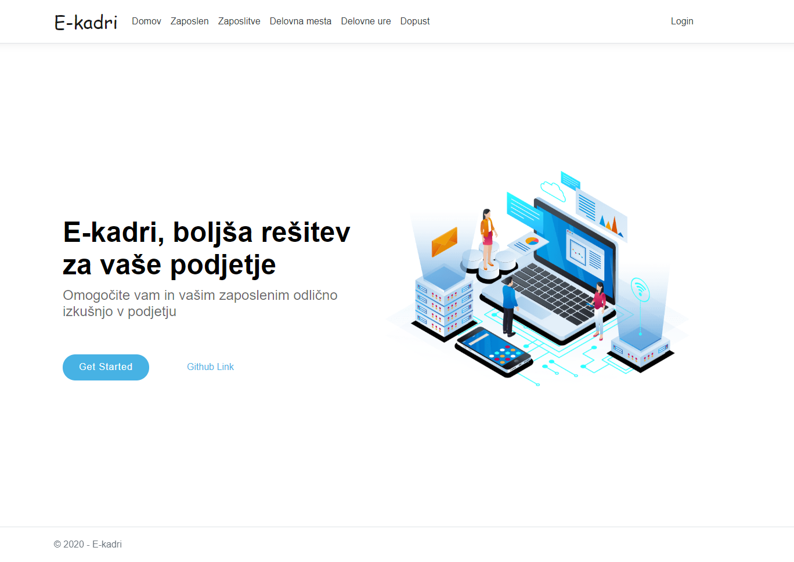

# e-kader
This is an Information Systems project, which is made by Miha-theraketa and me :)

Avtorja:
  - Miha Žnidar 63190330
  - Klemen Štefe 63190283

Z informacijskim sistemom E-Kader želimo podpreti informiranje kadrovske službe o trenutjem stanju zaposlenih v celotnem mednarodnem podjetju.
Celotni sistem bo dostopen samo priviligiranim uporabnikom (delavcem v kadrovski službi in ostalim v podjetju).
Omogočal bo dodajanje, odvzemanje novih zaposlenih, pregled informacij o posamezniku, pregled delovnih ur, izbiro dopusta, urnik in še nekaj podrobnosti.
Vsi zaposleni, ter njihovi podatki so zapisani v skupni bazi, ki temelji na Microsoftovi SQL server bazi.

Izgled domače strani

Tako, izgledata strani za vpogled nad zaposlenimi, in razporeditev zaposlenih po delovnih mestih. Vpogled na njiju imajo samo osebe z nazivom kadrovska služba, ter seveda admin.

Aplikacija je šefa na voljo v android verziji, kjer lahko opravi hiter pregled delavcev, in tudi vnos novega delavca.
Slike še pridejo....

# Razporeditev dela
Ideja se je porodila, saj Miha želel izdelati podobno aplikacijo za neko restavracijo. Predstavljena ideja je bila Klemnu všeč, zato sva se lotila z izdelovanjem e-Kadra.
Klemen je vzpostavil github z osnovno aplikacijo, na poratlu Discord sva se zmenila in porazdelila delo, ter probleme, kjer se je zatikalo probavala reševati skupaj.
Najprej, sva skupaj narisala konceptualni model podatkovne baze, Klemen je spisal modele, in jih zgeneriral, dodal je dodajanje slik. Miha pa se je lotil izdelovanja logina in registracije, ter avtorizacije. Za izdelavo drugega dela seminarse naloge, je Klemen objavil aplikacijo ter podatkovno bazo v azure. Miha pa je med tem že delal na REST programskem vmesniku in dodal swagger, ki je Klemenu koristil, kot dokumentacija ob izdelavi android aplikacije. Miha je kasneje dodal tudi avtentikacijo na REST vmesnik, za to so bile potrebni manjsi popravki pri klicu REST api-jev iz mobilne aplikacije.

